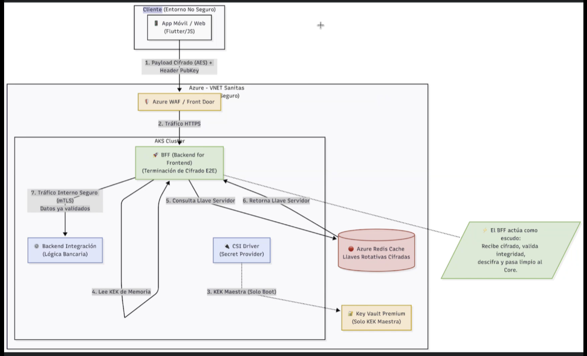
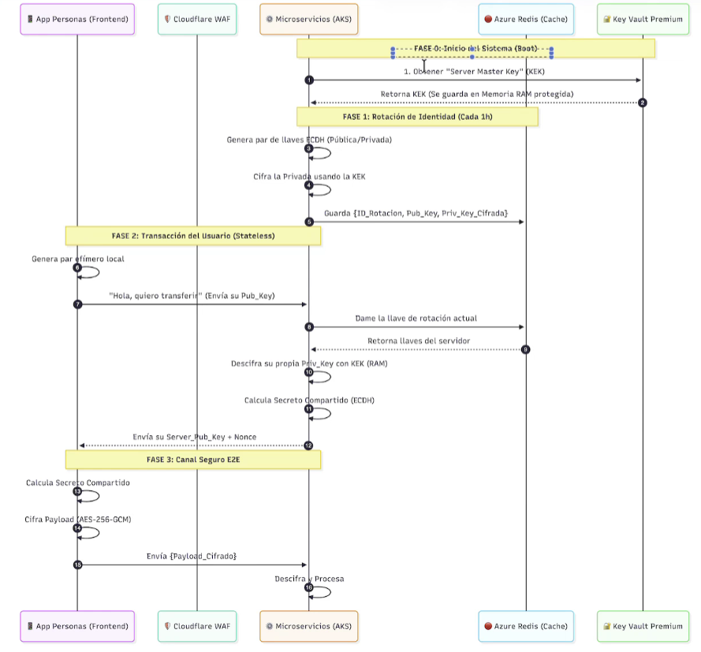

# Habilitadores Backend y Frondend (Estrategias de Cifrado)

Cifrado en tránsito E2E  

  

hashshake

Restringir acceso a 

API para obtener llaves
+ Libreria de cifrado
Llaves en cache

Cifrado hibrido
Frontend tiene llave publica
CSI Driver y cache de llaves en BFF

Llave unica 
Proteger llave maestra

Stateless Hybrid Encryption

Algoritmo: Usaremos Elliptic Curve Diffie-Hellman (ECDH).  Para el intercambio de llaves y AES-256-GCM para el cifrado de datos con PFS.

Se generan llaves en tiempo de ejecución 
- pruebas de perfonmance (faltas métricas de performance)
- 

